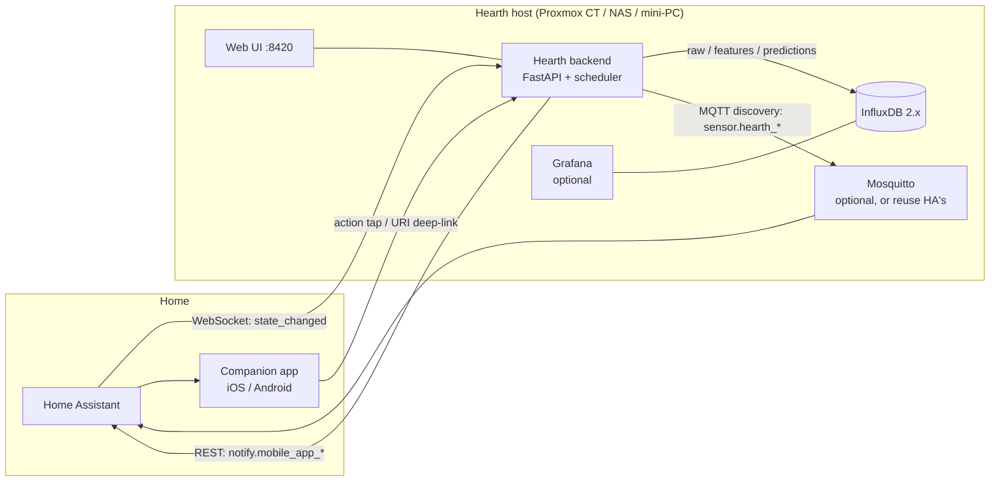
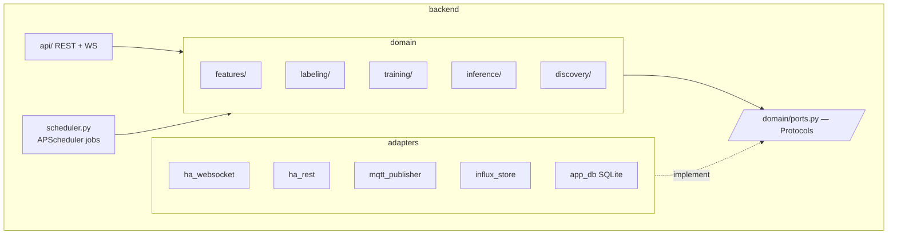

# Hearth Architecture

> Status: accepted · June 2026
> Companion docs: [DATA_MODEL.md](DATA_MODEL.md) · [UI_SPEC.md](UI_SPEC.md) · [DESIGN.md](DESIGN.md) · [SECURITY.md](SECURITY.md) · [RESEARCH.md](RESEARCH.md) · [ROADMAP.md](ROADMAP.md)

## 1. System context

Hearth is a standalone service that sits **next to** Home Assistant, the same way
Frigate does: HA remains the source of sensor truth and the automation engine;
Hearth owns everything between raw states and an activity prediction.



Three pillars, exactly as required:

1. **Data pipeline** — collect from HA → raw into InfluxDB → clean + engineer →
   **features written back to InfluxDB** (a queryable feature store).
2. **Model + training** — versioned models, scheduled + on-demand training,
   honest evaluation.
3. **Output + feedback loop** — predictions out to HA entities; uncertainty-driven
   questions back to humans; labels close the loop.

## 2. Architectural style: modular monolith, hexagonal core

One backend container. At this scale (one home, ~50 sensors, one prediction per
person per 30 min) microservices buy nothing and cost operational pain. Instead,
boundaries are enforced *inside* the process:

```
api/        thin HTTP/WS layer — no business logic
domain/     pure Python: pandas/sklearn, no I/O, no SDK imports   ← the product
adapters/   every external system behind a Protocol from domain/ports.py
main.py     composition root: builds adapters, injects into domain, starts API + scheduler
```

**The dependency rule:** `domain/` imports nothing from `api/` or `adapters/`.
Adapters implement `domain/ports.py` Protocols (`TimeSeriesStore`, `EventSource`,
`Notifier`, `EntityPublisher`, `AppRepo`, `ModelStore`). This is what makes the
prototype's biggest pains impossible by construction: domain code can't acquire a
second InfluxDB client, can't sneak a REST call into a feature function, and every
adapter is swappable (InfluxDB 3 / Timescale later — see ADR-3).



## 3. The data pipeline (pillar 1)

### 3.1 Ingest — Hearth owns it, not HA's config

The prototype required users to hand-edit HA's `influxdb:` include list and
restart HA for every new sensor — the single biggest setup failure mode. Hearth
instead subscribes to HA's **WebSocket API** (`state_changed` events) for exactly
the entities the user selected in the UI, and writes them to `har_raw` itself.

- Zero HA configuration. Adding a sensor = one click in the Hearth UI.
- Reconnect with exponential backoff; on reconnect, gap-fill via HA's REST
  history API (`/api/history/period`) so cron-less ingest survives restarts.
- Optional **backfill importer** reads an existing HA→InfluxDB bucket (the
  har-homelab case: 185k+ points since April) so current users keep their history.

### 3.2 Entity bindings — how Hearth generalizes across homes

The prototype hardcoded entity names (`binary_sensor.presence_sensor_sofa`).
Hearth instead binds entities to **roles** with semantic metadata:

```yaml
binding:
  entity_id: binary_sensor.presence_sensor_sofa
  role: presence            # presence | power | media | env | person | bed |
                            # light | door | focus | alarm_time | custom
  room: living_room
  person: null              # or a household member id (e.g. alice) for personal sensors
  options: {on_threshold: 10}   # role-specific (e.g. watts)
```

Feature extraction is keyed on **role**, not entity id. A `power` binding always
yields `{room}_{name}_on`, `_max_w`, `_kwh_delta`; a `media` binding always yields
`_playing`, `_paused`, `_active_clients`. New home, different sensors, same
recipes. The onboarding wizard pre-suggests roles from HA's `device_class`,
`domain` and unit of measurement; the user confirms in one screen.

### 3.3 Window builder + feature store

A scheduler job (default every 5 min, configurable) materializes **30-min sliding
windows** (stride 5 min at inference, stride 30 min for training matrices — denser
inference, non-leaky training):

```
har_raw ──► prepare (resample 1-min, role-aware ffill limits)
        ──► extract (per-binding recipe → features)
        ──► compose (cross-binding features: lights_off+bed, media+sofa, lags)
        ──► impute  (semantic sentinels: -1 = "sensor absent", 0 = "event absent")
        ──► write to har_features (tagged feature_set=vN, person=…)
```

Features are **persisted to InfluxDB** — requirement #1 — which buys: training
reads a precomputed matrix (fast retrains, reproducible), Grafana can chart any
feature, and inference and training are guaranteed to see identical values
(no train/serve skew — lesson from the prototype's dead `prev_label` features).
Feature definitions are versioned; a changed recipe bumps `feature_set` and
triggers backfill of the new column(s) only.

Forward-fill semantics are **role metadata**, not scattered constants: each role
declares `ffill_limit`, `absence_value`, and whether it's a *slow sensor*
(state-change-only writers like `person.*` get a 7-day lookback — direct port of
the prototype's `SLOW_SENSORS` fix).

## 4. Model + training (pillar 2)

### 4.1 Label system — three provenances, one table

| Provenance  | Source                                  | Trust  |
|-------------|------------------------------------------|--------|
| `bootstrap` | rule engine (user-editable rules in UI)  | low    |
| `llm`       | LLM weak annotator over historical window summaries (§6b) | low-medium |
| `discovered`| cluster the user named (§6)              | medium |
| `confirmed` | human answered a question / UI inbox / manual override | high |

Training overlays them by trust. **Evaluation is reported separately on
`confirmed` labels only** — the prototype's "90% accuracy" mostly measured
agreement with its own bootstrap rules; Hearth's headline metric is honest by
construction (`accuracy_confirmed` vs `accuracy_bootstrap`, both shown in UI).

The rule engine is deliberately simple weak supervision (Snorkel-style labeling
functions without the framework): each user rule is a predicate over feature
columns (`kitchen_presence > 0.3 AND stove_fumes_any == 1 → cooking`), composed
by priority. Rules are data, stored in SQLite, editable in the UI — clustering
proposes new ones (§6).

### 4.2 Activity taxonomy — user-defined, hierarchical

```
sleeping | away ── away/school, away/work …
home_awake ───── home/cooking, home/movie, home/working …
```

Users CRUD activities in the UI (requirement: "cooking, chilling etc — different
per user"). Two-level hierarchy mirrors the prototype's two-stage notifications:
stage 1 asks the top level, stage 2 the sub-activity. The model trains on leaves
when a parent has enough confirmed children, else on the parent — automatic
curriculum as labels accumulate.

### 4.3 Trainer + model registry

- **Household is a first-class, user-defined concept** — Hearth ships with zero
  hardcoded people. Members are created in the UI (any number: adults, kids,
  roommates), each with their own sensors bindings, ask policy, taxonomy
  enablement and model. Members without phones (kids) are inbox-labeled only.
  Nothing in code, storage or entity naming assumes a two-person home.
- Per-person models (the prototype proved one shared model mispredicts whoever
  has fewer labels). One `Trainer.run(person)` per enabled member, scheduled
  weekly + on-demand from the UI ("Train now" button with live log streaming
  over WS).
- Baseline: RandomForest (ported, known-good). The `Estimator` port allows
  gradient boosting / calibrated models later without touching callers.
- Registry (SQLite + `models/` volume): version, feature_set, train window, label
  counts by provenance, full metric report (accuracy both ways, per-class
  P/R/F1/AUC, confusion matrix, top SHAP importances), promotion status.
- **Promotion gate:** new model replaces active only if `accuracy_confirmed`
  doesn't regress >2 pts; UI offers one-click rollback (port of prototype logic).

## 5. Output + feedback loop (pillar 3)

### 5.1 Predictions out — official Hearth HA integration (primary), MQTT (alt)

Primary channel is a thin **custom HA integration** (`integration/` in this
repo, distributed via HACS) — the Frigate model. UX: in HA, *Add integration →
Hearth → enter host (e.g. `192.168.1.50:8420`) + API token* (generated on
Hearth's Settings page). The config flow validates against `/api/health`,
discovers the household, and creates a proper device per member with entities:

```
sensor.hearth_<person>_activity        state = smoothed activity
                                       attrs: raw, confidence, probabilities,
                                              window_ts, because (SHAP strip)
sensor.hearth_<person>_confidence      %
switch.hearth_<person>_questions       asking-policy opt-out (two-way)
select.hearth_<person>_override        manual override (two-way)
binary_sensor.hearth_online            stack liveness
```

The integration subscribes to Hearth's WebSocket (`/ws`) for push updates —
no polling, sub-second entity updates, all local. Install is one-click from
the wizard: deep links into the user's own HA via `/_my_redirect/…` (the
endpoints behind my.home-assistant.io buttons), and the backend announces
`_hearth._tcp.local.` over mDNS so HA's config flow discovers Hearth and
pre-fills the host — the token is the only thing typed. Automations consume
predictions natively: `trigger: state of sensor.hearth_alice_activity to
'movie' → dim lights`.

Alternative channels (same `EntityPublisher` port): **MQTT discovery** for
homes that prefer broker-based wiring or can't install HACS integrations, and
a degraded REST state-push fallback. The integration is the recommended path
because it needs no broker, survives restarts via the device registry, and
gives two-way controls (override/opt-out) a clean home.

API tokens are minted/revoked in Hearth's UI (hashed at rest, scoped:
`integration` tokens can read predictions + write overrides, nothing else).

### 5.2 Questions in — never trust the notification tag

Lesson learned the hard way: iOS drops the notification `tag` in action events.
Hearth's ask flow assumes only **action identifiers** round-trip:

1. Backend mints a short-lived `question` row (id, person, window_ts, predicted).
2. Notification actions encode the question id: `HEARTH_<qid>_CONFIRM`,
   `HEARTH_<qid>_ALT1`… An HA automation blueprint (shipped in `deploy/ha/`)
   forwards *any* `HEARTH_*` action to Hearth's `/api/feedback/action` webhook —
   one dumb automation, all parsing server-side.
3. Every notification also carries a URI deep link to the UI's labeling page
   (works even if actions fail).
4. The **UI inbox** is the primary labeling surface: a timeline of recent windows
   with predicted activity, one-tap correct/confirm, bulk-label a time range
   ("yesterday 19–21h = movie"). Notifications are just the push channel into it.

### 5.3 Asking policy

Uncertainty sampling (confidence < threshold) **plus ~7% random asks on confident
windows** — without exploration the model never learns where it's confidently
wrong (prototype bug). Budgeted (max N/day per person), cooldown + repeat
suppression ported, quiet hours respected, per-person opt-out toggle exposed as a
Hearth MQTT switch in HA.

## 6. Unsupervised discovery (the "what is sofa+jellyfin?" feature)

Nightly job over the last ~30 days of feature windows:

1. Reduce: select active/variance-bearing features → scale → UMAP (or PCA).
2. Cluster: HDBSCAN (handles noise; no forced k).
3. Describe: per cluster, compute a **signature** — top distinguishing features vs
   global mean (e.g. `sofa_presence ↑0.9, media_playing ↑0.95, hour≈21`), typical
   time-of-day histogram, sample windows.
4. Surface as **Pattern cards** in the UI: "Evenings, sofa occupied, Jellyfin
   playing — 43 windows. What is this?" → user names it ("Movie") → Hearth
   (a) labels those windows `discovered:movie`, (b) drafts a labeling rule from
   the signature for the user to accept/edit, (c) adds `movie` to the taxonomy if new.

This is the cold-start engine for new homes — and exactly the interaction the
requirement describes: model sees couch+Jellyfin co-occur, user says "that's
watching a movie", a rule is born.

## 6b. The onboarding assistant (LLM-powered, optional, BYO key)

The most labor-intensive step for a new home is semantic: mapping dozens of
cryptically-named entities to roles, picking composites, drafting starter
rules. That's a language task, so it's optionally outsourced to an LLM
(OpenRouter or any OpenAI-compatible endpoint; key entered in Settings, used
on demand, never required). The LLM is scaffolding: once the first model is
trained, predictions are 100% local ML and the key can be deleted.

### The entity inventory (input artifact)

Every home is different, so step one is a complete, automatic export — the
user clicks nothing per-entity. Hearth builds it from three HA calls:

1. `GET /api/states` — every entity, current state, all attributes
2. WS `config/entity_registry/list` — device_class, area, device, disabled
3. WS `config/area_registry/list` — area names (room candidates)

plus, when history exists (HA recorder via `/api/history/period`, or an
existing HA→Influx bucket), **aggregate stats per entity** over the last 7–30
days: distinct values, change frequency, active hours histogram, value range,
% missing. The result is one JSON document (schema in DATA_MODEL.md §5),
viewable and downloadable in the wizard — users can inspect exactly what
would be sent to an LLM, or take it to their own tooling.

### The assistant pass

```
inventory ──► LLM (structured output, schema-validated) ──►
  bindings    role/room/person per entity, with a reason each
  composites  candidate cross-sensor features, generously — RF tolerates
              useless features far better than missing ones
  taxonomy    starter activity set tailored to what the sensors can see
  rules       draft bootstrap rules per activity
  questions   anything ambiguous comes back as a question for the user
              ("two media players — which one is the living-room TV?")
```

The user approves/edits each screen and is done: ingest starts, features
backfill from history if available, the first model trains, and from then on
the LLM is out of the loop.

### LLM as weak annotator (the label-side payoff)

The model's *output vocabulary* is exactly the labeled classes — labels are
where semantics enter the system, and where the LLM adds the most value
beyond setup. Optional onboarding pass: batch the historical feature windows
into compact summaries ("Tue 21:30 — sofa 85%, media playing, kitchen
silent, both home") and have the LLM assign each a taxonomy slug + its own
confidence. Hundreds of windows fit in one call; weeks of history become
thousands of `provenance=llm` starter labels for roughly the cost of a
coffee. Guardrails: summaries only (same privacy contract as the inventory),
low-confidence answers dropped, trust tier between bootstrap and discovered,
and — like every non-human source — overlaid by confirmed labels and *never*
counted in headline accuracy. The first trained model then takes over;
steady-state prediction costs nothing and calls no one.

### Division of labor — who finds the patterns?

The "couch + jellyfin = movie" intuition is only needed where labels come
from (bootstrap rules). The classifier itself learns feature interactions
from data — given base features and a handful of confirmed labels it will
find combinations no one thought to write down. So: the LLM proposes *common
human* patterns as rules and candidate features (cheap, day 0); the RF learns
*this home's* interactions automatically (continuous); discovery clustering
(§6) surfaces regimes nobody named so a human can. Three mechanisms, three
different "pattern finders" — none requires the user to be the intuition
engine, which was the prototype's biggest hidden cost.

Guardrails (non-negotiable):

- **Propose, never apply.** All output is structured JSON validated against
  domain schemas, rendered as pre-filled wizard screens the user approves or
  edits. The LLM cannot execute anything or emit code.
- **Metadata only.** Entity ids, names, device classes, units and *aggregate*
  stats (value ranges, change frequency) are sent — never raw history, never
  person names beyond what the user typed into entity ids themselves.
- **Fully optional.** The heuristic suggester (device_class/domain/unit rules)
  covers the same screens without a key; the LLM just makes them smarter.
- Also reused post-setup for: cluster-naming hints on Pattern cards ("this
  looks like laundry"), and explaining a binding's proposed features in plain
  language.

Division of labor vs HEPA (RESEARCH.md §4): the LLM understands *names*
(semantics, one-shot at setup); HEPA understands *signals* (representations,
continuous). They attack different halves of the cold-start problem and
compose: LLM bootstraps bindings/rules on day 0, HEPA-powered discovery makes
the data speak after a few days of recording.

## 7. Web UI (summary — full spec in UI_SPEC.md)

React + TypeScript SPA, served by the backend container at `:8420`; REST for CRUD,
WebSocket for live predictions/training logs. Everything user-facing follows the
Hearth design language (DESIGN.md): warm ember `#F59E0B` on cool slate, one
accent that always carries meaning, the 47-icon outline set sharing the Ember
mark's stroke language, and dark/light/system theming via CSS tokens. Pages: **Onboarding wizard** ·
**Dashboard** (live activity per person, confidence, SHAP "because" strip) ·
**Inbox** (label/confirm) · **Activities** (taxonomy + rules) · **Patterns**
(cluster cards) · **Models** (registry, metrics, confusion matrix, AUC curves,
SHAP global importance, drift; train/rollback buttons) · **Sensors** (bindings,
freshness, ingest health) · **Settings** (HA/MQTT/Influx connections, tokens,
notification budgets, persons).

## 8. Deployment

`docker-compose.yml` ships: `influxdb` (2.7, pinned), `hearth` (backend+UI),
profiles for `grafana` and `mosquitto` (skip if reusing HA's broker). Single
`.env` for first-boot secrets; everything else is configured in the UI and stored
in SQLite (volume-mounted). Backend is one image; UI is built into it at image
build time. Health endpoints + heartbeat measurement for alerting. A HA add-on
wrapper is a later thin packaging of the same image (Frigate model).

## 9. Architecture decision records (condensed)

| ADR | Decision | Why (alternatives rejected) |
|-----|----------|------------------------------|
| 1 | Modular monolith, hexagonal | Microservices: ops cost, no scale need. Layered-only: prototype showed I/O leaks everywhere without enforced ports. |
| 2 | Ingest via HA WebSocket, Hearth writes raw itself | HA influxdb export: requires YAML edits + restart per sensor, schema collisions (`value` vs `state`), no control over precision. |
| 3 | InfluxDB 2.x behind `TimeSeriesStore` port | Flux is deprecated in InfluxDB 3 — the port confines the blast radius; Timescale/QuestDB swappable. HA ecosystem familiarity wins for v1. |
| 4 | App state in SQLite (SQLAlchemy), not Influx | Taxonomy, bindings, rules, registry, questions are relational/transactional; time series DBs are wrong for this. Postgres unnecessary at this scale. |
| 5 | Entities out via MQTT discovery, REST fallback | REST `/api/states` is ephemeral (restart-loss) and registry-less — proven pain. Custom component: high maintenance, blocks casual installs. |
| 6 | Feedback keyed on action IDs + server-side question rows | iOS never returns notification tags (home-assistant/iOS#1666) — proven failure in prototype. |
| 7 | Features persisted to InfluxDB, versioned | Reproducible training, no train/serve skew, Grafana-inspectable. Cost: storage (trivial at 48–288 rows/day). |
| 8 | Role-based feature recipes | Hardcoded entity names don't generalize; device-class-driven recipes are the portability mechanism. |
| 9 | RF baseline, `Estimator` port for successors | Known-good on this exact problem; calibrated GBMs later without API change. |
| 10 | React SPA served by backend | Streamlit: weak for a product-grade comprehensive UI. Grafana-only: can't do wizards/inbox/taxonomy CRUD. |
| 11 | HA custom integration (HACS) as primary output channel | Host+token config flow, push via Hearth's WS, two-way controls, no broker dependency — Frigate-proven. MQTT/REST remain as alternates behind the same port. |
| 12 | Optional LLM advisor for onboarding (BYO OpenRouter/OpenAI-compatible key) | Semantic mapping of entity names is the costliest user step; LLM proposes (JSON, schema-validated), human approves. Heuristics remain the no-key path. Metadata only, never raw history. |
| 13 | InfluxDB is optional in the stack: compose `influxdb` profile (bundled) vs connect-existing in the wizard | Many homelabs already run InfluxDB for HA; forcing a second instance wastes RAM and splits data. Hearth boots DB-less; the wizard forks "have one" (URL/org/token, buckets created in place) vs "set it up for me" (detects/instructs the profile). |
| 14 | Accounts + centralized secrets: first-boot admin account, argon2id passwords, server-side sessions, scoped API tokens; ALL crypto in `hearth/security.py` | Shippable product needs auth out of the box (git clone → UI → create account). One module owning every secret operation makes "where do secrets live?" a one-page answer (docs/SECURITY.md) and scattered-crypto a reviewable defect. |
